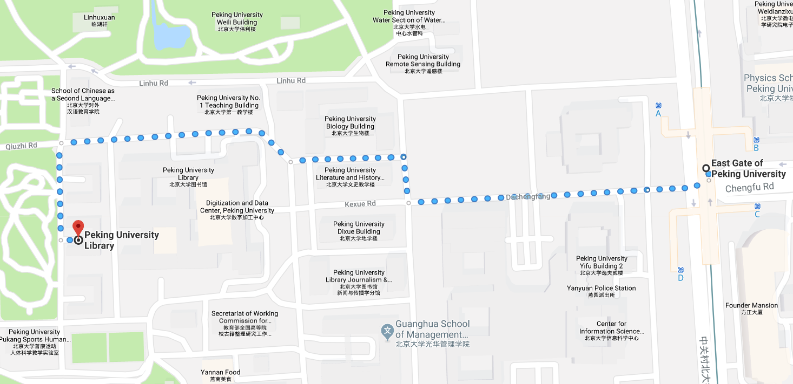

# Venue

## Location

Some pictures, TBD.

## Transportation
The East Gate of Peking University is about 34km from the Beijing Capital International Airport (Terminal 3), and can be accessed by various ways:

#### By Taxi
Taking a taxi from the airport is the most convenient way to access the hotel. 
It may cost around 1 hour and about 100RMB.

#### By Subway
- Take the  Airport Express  to the "SanYuanQiao (三元桥)" Station
- Transfer to  Line 10  to the "HaiDianHuangZhuang (海淀黄庄)" Station
- Transfer to  Line 4  for the "East Gate of Peking University (北京大学东门)" Station
That will cost about 1.5 hours. For more details, see the map of Beijing Subway.

#### By Bus
- Take the Airport Shuttle Bus  Line 5 , to ZhongGuanCun (中关村) Stop
- Take Bus 601 or 498 to the "ZhongGuanYuan (中关园)" Station
- Walk to the opposite side of the street
That will cost about 2.5 hours. For more details, see the homepage of the Airport Shuttle Bus.

## Map

[Google Map](https://www.google.com/maps/dir/East+Gate+of+Peking+University,+Haidian+Qu,+Beijing+Shi,+China/39.991656,116.3087305/@39.9923455,116.3099882,17z/data=!3m1!4b1!4m9!4m8!1m5!1m1!1s0x35f056ae7f23816b:0x1bcbb3f0d4ea5490!2m2!1d116.315843!2d39.992274!1m0!3e2)

[Baidu Map](https://j.map.baidu.com/Vu6I2)